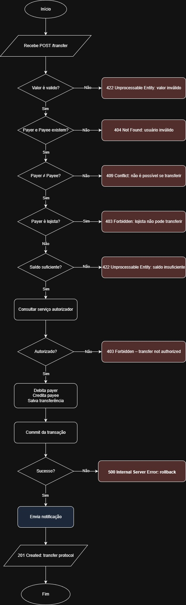

> Este projeto foi desenvolvido como desafio técnico e também como um estudo prático de arquitetura de software,
> aplicando conceitos como DDD, Clean Architecture e testes automatizados.

# Transfer Challenge – Laravel 12

Este projeto implementa uma **API de transferências financeiras** inspirada em um desafio técnico, utilizando **Laravel 12**, **DDD**, **Clean Architecture** e boas práticas de engenharia de software.

---

## Visão Geral

A API permite que usuários realizem transferências seguindo regras de negócio:

- Apenas usuários **common** podem transferir
- Usuários **merchant** apenas recebem
- Saldo deve ser suficiente
- A transferência precisa ser autorizada por um serviço externo
- Notificação é enviada após a transferência

---

## Arquitetura

O projeto segue uma separação clara em **Domain**, **Application** e **Infrastructure**.

### Domain
Contém o **coração do negócio**:

- Entidades (`User`, `Wallet`, `Transfer`)
- Enums (`UserType`, `TransferStatus`)
- Exceções de domínio
- Interfaces de repositório
- **Eventos de domínio** (ex: `TransferCompleted`)

---

### Application
Contém os **casos de uso**:

- `TransferService` (orquestra o fluxo de transferência)
- Usa entidades e regras do domínio

---

### Infrastructure
Contém os **detalhes técnicos**:

- Controllers e Requests HTTP
- Implementações Eloquent dos repositórios
- Clients externos (Authorization / Notification)
- Event Listeners
- Providers

---

### Estrutura de Pastas (resumida)

```text
app/
├── Domain/
│   ├── User/
│   ├── Notification/
│   ├── Wallet/
│   └── Transfer/
│
├── Application/
│   └── Services/
│       └── TransferService.php
│
├── Infrastructure/
│   ├── Http/
│   ├── Persistence/
│   ├── External/
│   ├── Listeners/
│   └── Providers/
```

---

## Fluxo da Transferência



---

## Endpoint

### POST `/api/transfers`

**Request**
```json
{
  "payer": 1,
  "payee": 2,
  "value": 100
}
```

**Response – 201**
```json
{
    "code": 201,
    "message": "Transfer created",
    "protocol": "7d1c0c9a-c3e4-4659-bb6c-b00cd25153a4"
}
```

---

## Testes

O projeto possui **testes unitários e de integração (feature)**.

### Unit Tests
- Testam o `TransferService` isoladamente
- Repositórios e clients são mockados
- Validam regras de negócio e exceções

### Feature Tests
- Testam o fluxo completo via HTTP
- Usam banco em memória (SQLite)
- Mockam serviços externos (Authorization / Notification)

```bash
php artisan test
```

---

## Serviços Externos

### Authorization Service (mock)
Simula autorização da transferência.

### Notification Service (mock)
Simula envio de notificação:
- Falhas **não quebram** o fluxo principal
- Executado via Event Listener após commit

---

## Melhorias Futuras

- Processamento Assíncrono (Filas)
- Logs, Metricas e Monitoramento
- Seperar banco do servidor
- Testes de concorrência
- Rate limit por usuário

---

## Como rodar o projeto

Script para subir o projeto
```bash
scripts/build-and-up
```

Caso queira rodar sem Docker:
```bash
composer install
cp .env.example .env
php artisan key:generate
php artisan migrate --seed
php artisan serve
```
